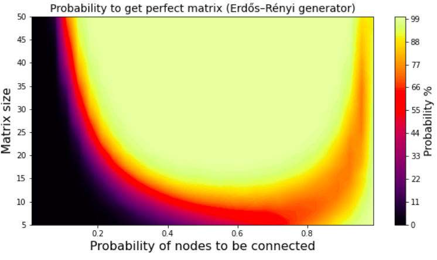
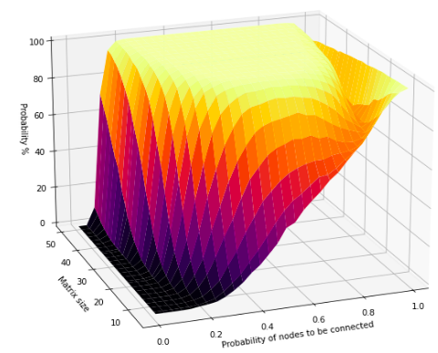
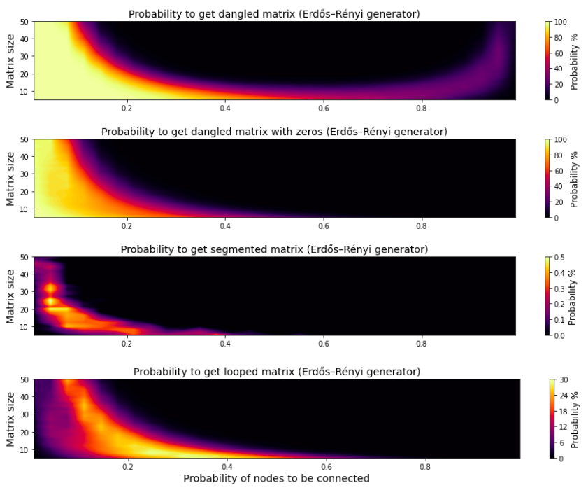

# About
Final project for "Mathematics for engeneers" course. 
This repository is devoted to the PageRank problem.
Here you can find the implementation of Transition matrices (Erdős–Rényi model and Bollobás–Riordan), description of possible problems (dangling, segmented, looped) for generated matrices, and corrections to avoid such problems (random connections, weak connections with dampling factor). 
Also, here we have three kinds of solvers: 1) based on NumPy eig function. 2) Power method. 3) Markov chain Monte-Carlo approach. 

Finally, this package can be split into two: "slow" (with usual python implementation) and "fast" with jitted python implementation.

# How to use it?
In order to repeat our experiments, you can use `main.ipynb` file. If you want to use our package, just use the first cell from `main.ipynb` to download the module and then use it as you with.

# Our reults
Firstly, we tried to understand when each kind of problem can appear in order to use parametrs where it's difficult to get some one.
To do this for Erdős–Rényi model we created a grid of matrix sizes and probabilities for nodes to be connected, then for each point of grid we generated 5000 matrices and check them for problems. On the following graph the color represents the probability to get matrix without problems: 

2D plot                                                    |  3D plot
:---------------------------------------------------------:|:-------------------------:
  |   

On the following graphs we checked how often each king of problem appear. Here colors represents probability to get specific kind of the problem 

 

